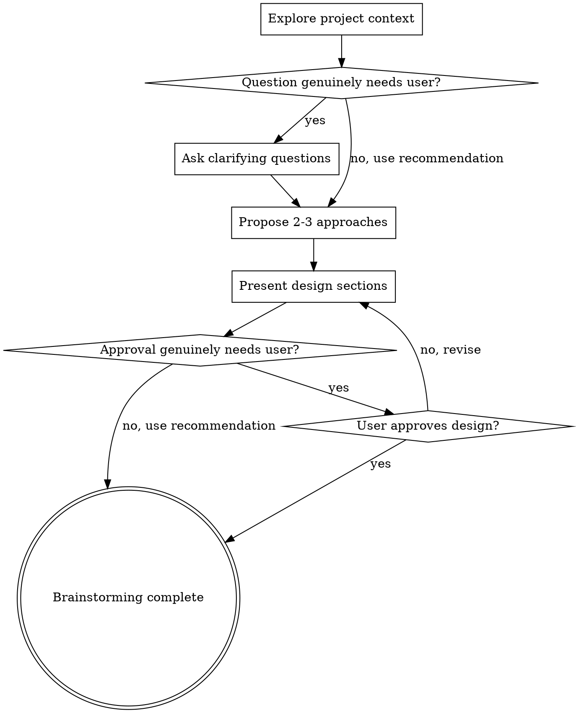

# Brainstorming Ideas Into Designs

## Overview

Help turn ideas into fully formed designs and specs through natural collaborative dialogue.

Start by understanding the current project context, then ask questions one at a time to refine the idea. Before asking each question, check whether you can safely answer it with the recommended assumption and continue without interrupting the user. Once you understand what you're building, present the design and get user approval, applying the same check before every approval request.

<HARD-GATE>
Do NOT invoke any implementation skill, write any code, scaffold any project, or take any implementation action until you have presented a design and cleared its approval gate. Before asking for approval, check whether you can safely choose the recommended decision for the user. If so, record that decision and continue without asking; otherwise, obtain the user's approval. This applies to EVERY project regardless of perceived simplicity.
</HARD-GATE>

## Anti-Pattern: "This Is Too Simple To Need A Design"

Every project goes through this process. A todo list, a single-function utility, a config change — all of them. "Simple" projects are where unexamined assumptions cause the most wasted work. The design can be short (a few sentences for truly simple projects), but you MUST present it and clear its approval gate before implementation.

## Checklist

You MUST create a task for each of these items and complete them in order:

1. **Explore project context** — check files, docs, recent commits
2. **Ask clarifying questions** — one at a time; before each question, check whether the recommended assumption lets you proceed without asking
3. **Propose 2-3 approaches** — with trade-offs and your recommendation
4. **Present design** — in sections scaled to their complexity; after each section, run the recommendation-first check before requesting approval

## Process Flow

**The terminal state is an approved or safely self-cleared design.** Return the design and stop. Do NOT automatically write a design document, invoke a planning skill, or begin implementation.

## The Process

**Understanding the idea:**

- Check out the current project state first (files, docs, recent commits)
- Ask questions one at a time to refine the idea
- Before each question, check whether project evidence and a clearly recommended assumption are sufficient to proceed; ask only when the answer cannot be safely inferred and genuinely requires the user's judgment or authority
- Prefer multiple choice questions when possible, but open-ended is fine too
- Only one question per message - if a topic needs more exploration, break it into multiple questions
- Focus on understanding: purpose, constraints, success criteria

**Exploring approaches:**

- Propose 2-3 different approaches with trade-offs
- Present options conversationally with your recommendation and reasoning
- Lead with your recommended option and explain why
- Before asking the user to pick an option, check whether you can safely choose and carry forward the recommendation yourself

**Presenting the design:**

- Once you believe you understand what you're building, present the design
- Scale each section to its complexity: a few sentences if straightforward, up to 200-300 words if nuanced
- Ask after each section whether it looks right so far, but first check whether the recommended decision is safe to carry forward without user approval
- Cover: architecture, components, data flow, error handling, testing
- Be ready to go back and clarify if something doesn't make sense

## Key Principles

- **Recommendation-first checkpoint** - Before every question or approval request, decide whether the recommended option is safe to choose for the user
- **Ask only when necessary** - Ask only when the checkpoint shows that the choice genuinely requires the user's information, judgment, risk tolerance, or authority
- **One question at a time** - Don't overwhelm with multiple questions
- **Multiple choice preferred** - Easier to answer than open-ended when user input is genuinely required
- **YAGNI ruthlessly** - Remove unnecessary features from all designs
- **Explore alternatives** - Always propose 2-3 approaches before settling
- **Incremental validation** - Present the design section by section and clear each approval gate through either the safe recommendation or explicit user approval
- **Be flexible** - Go back and clarify when something doesn't make sense
