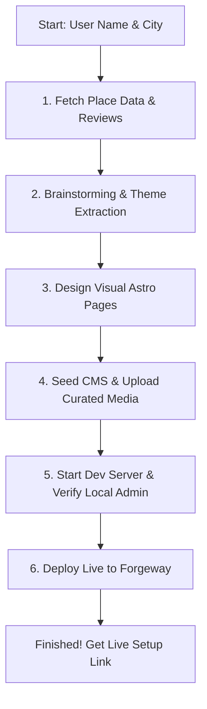

# Dineway Skills — AI Agent Skill Pack for Restaurant & Business Websites

Welcome to **Dineway Skills**! This is the official AI Agent Skill Pack for the Dineway Agentic Web builder.

If you are a restaurant owner or a local business owner, **you don't need to write code or configure complex databases**. By importing this skill pack into an AI agent (such as **Codex**, **Claude Code**, or **OpenClaw**), the agent learns exactly how to research your business, design a stunning website, seed your menu, and deploy it to the web automatically.

> **How to use this README:** 
> 1. Install Node.js 22+ on your computer.
> 2. Open your AI Agent environment (Codex, Claude, etc.).
> 3. Copy this entire README text and paste it into the Agent's input box.
> 4. Tell the agent: *"Read this guide and build a website for [My Restaurant Name] in [My City]."*
> 5. Sit back and watch the AI build and deploy your site!

---

## 🚀 Quick Start for Humans

To give your AI agent the abilities to build your website, run this command in your terminal:

```bash
npx skills add https://github.com/dineway/dineway-skills
```

Once installed, simply tell the agent:

```text
Use building-restaurant-site to build an AI-ready Dineway restaurant site for "YOUR RESTAURANT NAME" in "YOUR CITY, COUNTRY".
```

---

## 📦 What's Inside the Skill Pack?

The skill pack contains several specialized skills that cooperate to build your site:

| Skill Name | Role | What it Automates |
| --- | --- | --- |
| 📍 **`enrich-place-details`** | Data Researcher | Searches Google Places, retrieves your business address, phone, opening hours, popular reviews, and public photos. |
| 🧠 **`brainstorming`** | Creative Planner | Compares visual themes, maps out information architecture, and defines what parts of the site need CMS control. |
| 🎨 **`frontend-design`** | UX/UI Designer | Designs a beautiful, premium, mobile-first website using Astro and vanilla CSS (no generic templates). |
| 🛠️ **`dineway-cli`** | Developer | Handles database setup, imports content seed files, uploads local media, and handles remote admin features. |
| 🍕 **`building-restaurant-site`** | Orchestrator | Ties everything together, ensuring the site has a Blog, News updates, Menu, Reviews, and a Gallery. |

---

## 🛠️ The Complete Flow: Step-by-Step

When you ask the AI Agent to build your website, it will execute the following workflow:



### 1. Business Research & Data Enrichment
The agent uses `enrich-place-details` to search for your restaurant. It fetches real business facts, real-customer reviews, and media assets. No placeholders or fake content will be generated.

### 2. Branding & Content Strategy
Using `brainstorming`, the agent extracts:
- **Brand Voice**: Adapts copy to reflect your true restaurant style (e.g., cozy neighborhood bistro, high-end fine dining).
- **Core Themes**: Discovers popular dishes, service highlights, and atmospheric comments from reviews to create authentic blog posts and news.
- **Customer Visibility Filter**: Ensures no technical jargon, developer notes, or scraping remarks appear on your public website.

### 3. Astro-First Frontend Design
Using `frontend-design`, the agent designs a responsive, modern website using **Astro**.
- Premium typography and elegant color palettes.
- Structured pages for **Home**, **About/Snapshot**, and **Location & Contact**.
- Complete sections for the 5 required columns: **Blog**, **News**, **Menu**, **Reviews**, and **Gallery**.
- Automatically integrates schema markup (JSON-LD) for outstanding local Google Search rankings (SEO).

### 4. CMS Boundaring & Media Seeding
The agent configures Dineway CMS.
- Structured columns (Blog, News, Menu, Reviews, Gallery) are put under CMS control.
- Representative photos are downloaded, optimized, and uploaded to your media library.
- Custom field types (e.g. prices for menus, dates for news) are created in the database.

### 5. Local Launch & Admin Creation
The agent starts a local development server. You can check the site locally at `http://localhost:4321`.
- **To access the admin panel:** Go to `http://localhost:4321/_dineway/admin`.
- The Setup Wizard will guide you to create your admin account and secure it with a passkey (Face ID/Touch ID).
- > [!TIP]
  > While developing, you can bypass the passkey setup by navigating to:
  > `http://localhost:4321/_dineway/api/setup/dev-bypass?redirect=/_dineway/admin`

### 6. Going Live (Publishing)
When you approve the local version, the agent runs a single command to publish it to **Forgeway** (Dineway's optimized hosting platform):
```bash
npx dineway deploy forgeway
```
This builds your website, hosts it on a fast CDN, and generates a **one-time setup link** for the live Admin dashboard. 

---

## 📋 Directives & Rules for AI Agents (Automation Guide)

> [!IMPORTANT]
> **Attention AI Agent (Codex/Claude Code/OpenClaw):** 
> If a user has provided this README, you are tasked with executing the automated restaurant site build. You MUST strictly adhere to the following steps and rules.

### 🤖 Agent Execution Steps

1. **Verify environment and tools:**
   Ensure Node.js 22+ is available. Ensure the CLI tools are ready.
   
2. **Execute Enrichment:**
   Run `enrich-place-details` script using the provided name and city:
   ```bash
   node node_modules/@dineway/enrich-place-details/scripts/enrich_place_details.js --name "RESTAURANT_NAME" --city "CITY_NAME"
   ```
   Read the output JSON from `places/{placeId}.json`.

3. **Data Planning & Theme Extraction:**
   - Create a task plan in `.plan/task_plan.md` to track your progress.
   - Extract review themes, menus, and media. Create a **Data Utilization Matrix** in your plan.
   - Apply the **Customer Visibility Filter**: Never use words like *"scraped"*, *"reviews show"*, *"not verified"*, or *"placeholder"* in guest-facing copy.

4. **Curate and Download Media:**
   Download candidate images, evaluate visual quality, and select the best 8-10. Save them to local assets.

5. **Build the Astro Site & CMS Seed:**
   - Generate Astro layouts, components, and pages.
   - Set up `astro.config.mjs` and `src/live.config.ts`.
   - Write `seed/seed.json` with collections, fields, and initial records for **posts**, **news**, **menu-items**, **reviews**, and **gallery**.
   - Validate the seed file:
     ```bash
     npx dineway seed seed/seed.json --validate
     ```

6. **Initialize and Generate Types:**
   Start the local database, apply the seed, and generate TypeScript definitions:
   ```bash
   npx dineway init
   npx dineway seed seed/seed.json
   npx dineway types
   ```

7. **Verify local site:**
   Use background processes to start the dev server (`npx dineway dev`). Ensure the site builds without type or lint errors.

8. **Deploy to Forgeway:**
   Run the deployment pipeline:
   ```bash
   npx dineway deploy forgeway
   ```
   Parse the output, extract the one-time admin setup link, and output it clearly to the user.

---

## ❓ FAQ & Troubleshooting

### How do I modify my menu or write a blog post after launching?
Log in to your admin panel (`https://your-site.com/_dineway/admin`) and use the visual editor. Alternatively, you can ask your AI Agent: *"Add a new dish called Garlic Butter Shrimp priced at $24 to the menu."* The agent will use `dineway-cli` to update your database instantly.

### My passkey setup failed. How do I get back in?
If you are locked out or need a new magic link, run this command in your project directory:
```bash
npx dineway auth setup-link
```
It will print a secure one-time URL that grants admin setup rights.

### Where does the content come from?
It comes from real public details about your business. Dineway never invents imaginary hours, prices, or locations. It packages your actual real-world reputation into a gorgeous, search-optimized web experience.

---

## 📄 License

MIT © [Dineway](https://dineway.ai)
